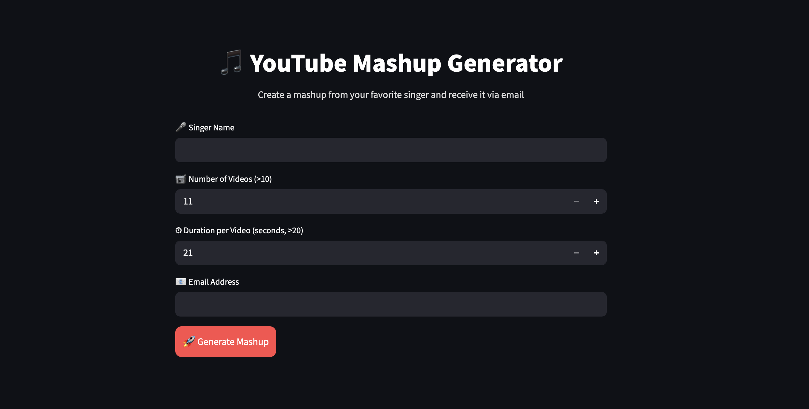

# YouTube Mashup Generator

A modern Streamlit web application that generates a mashup from YouTube videos of your favorite singer and delivers it directly via email.

This project was developed as part of the Mashup Assignment, which includes:

- Command Line Mashup Program  
- Web App Mashup Generator  
- Email delivery of generated mashup  
- Secure credential handling  

---

## UI Preview



---

## Features

- Download N YouTube videos of a singer  
- Extract and trim first Y seconds from each video  
- Merge all trimmed audios into one mashup  
- Compress output into ZIP file  
- Automatically send mashup to user email  
- Secure credentials using Streamlit Secrets  
- Automatic cleanup of temporary files  

---

## Tech Stack

- Python  
- Streamlit  
- yt-dlp  
- FFmpeg  
- SMTP (Gmail App Password)  

---

## How It Works

1. User enters:
   - Singer Name  
   - Number of Videos (>10)  
   - Duration per Video (>20 seconds)  
   - Valid Email Address  

2. Application:
   - Searches and downloads videos using yt-dlp  
   - Extracts and trims audio using FFmpeg  
   - Merges all trimmed audio clips  
   - Creates `mashup.zip`  
   - Sends ZIP file to user email  

---

## Secure Credentials

This project uses Streamlit Secrets to store email credentials securely.

Create a `.streamlit/secrets.toml` file locally:

```toml
SENDER_EMAIL = "your_email@gmail.com"
EMAIL_PASSWORD = "your_app_password"
```

---

## requirements.txt

```
streamlit
yt-dlp
```

FFmpeg must be installed separately and accessible via terminal.

---

## Run Locally

```bash
# Create virtual environment
python -m venv venv
source venv/bin/activate  # Mac/Linux

# Install dependencies
pip install streamlit yt-dlp

# Run the app
python -m streamlit run app.py
```

---

## Project Structure

```
Mashup/
│
├── app.py              # Streamlit Web Application
├── 102317084.py        # Command Line Mashup Program
├── UI.png              # UI Screenshot
├── requirements.txt
└── README.md
```

---

## Assignment Requirements Covered

### Program 1 — Command Line Application
- Parameter validation  
- Exception handling  
- Audio trimming and merging  
- ZIP file creation  

### Program 2 — Web Application
- User-friendly UI using Streamlit  
- Input validation  
- Email delivery of mashup  
- Secure secret handling  

---

## Author

Akshit Singla
